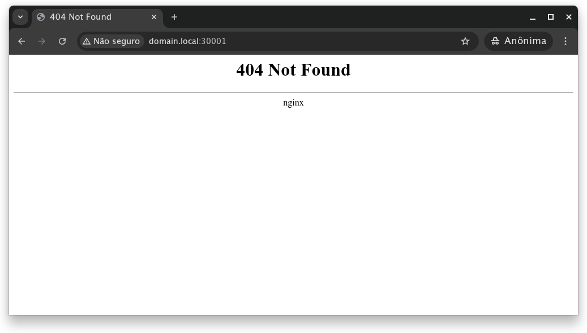
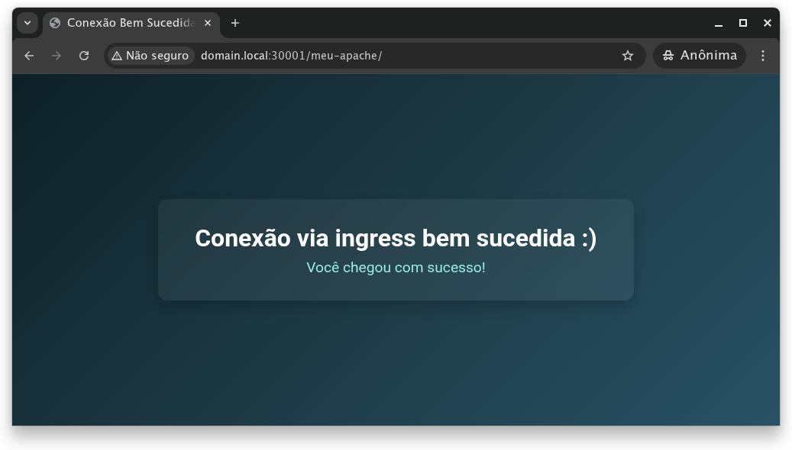

# 📌 Usando o KIND com NGINX Controller

Nesse guia, será abordado o uso do nginx como controlador de conexões entrantes HTTP.

O objetivo é a redução do uso de nodeports, visto que seu uso "prático" acaba aumentando a complexidade do ambiente. 

Pra quem já atuou na atividade de gerência de firewall e conexões sabe o quão complicado é manter esse controle, já que para cada endpoint é associado uma porta tcp. 

O uso do ingress funciona concentrando as conexões http e levando a tratativa para camada de aplicação.

Em suma, ao invés de configurar que o contexto "/app1" deve enviar para o nodeB na porta 30828, a configuração envia o contexto para o serviço do tipo clusterIP(serviço "padrão", interno do cluster), e toda a comunicação acontece internamente. 

Agora, mãos à obra.

## 1 - Configuração do cluster

Para não apresentar um guia repetitivo, seguir a configuração do cluster, disponível nesse [link](../kind-cilium/README.md).

## 2 - Configurando objetos

Alguns objetos precisam ser configurados/criados nesse guia para verificação do funcionamento e aplicação prática da ferramenta. 

Abaixo segue o *Howto* para cada componente.

### 2.1 - IngressController

Existem algumas opções de *controladores de ingress*, que podem ser listados nesse [link](https://kubernetes.io/docs/concepts/services-networking/ingress-controllers/#additional-controllers).

Neste guia, será adotado o ingress **nginx**.

Sua instalação pode ser feita aplicando o manifesto deste [link](https://raw.githubusercontent.com/kubernetes/ingress-nginx/controller-v1.12.3/deploy/static/provider/baremetal/deploy.yaml) ou através do conteúdo abaixo, que ja cria os componentes necessários para seu funcionamento.

```deploy.yaml```

```yaml
apiVersion: v1
kind: Namespace
metadata:
  labels:
    app.kubernetes.io/instance: ingress-nginx
    app.kubernetes.io/name: ingress-nginx
  name: ingress-nginx
---
apiVersion: v1
automountServiceAccountToken: true
kind: ServiceAccount
metadata:
  labels:
    app.kubernetes.io/component: controller
    app.kubernetes.io/instance: ingress-nginx
    app.kubernetes.io/name: ingress-nginx
    app.kubernetes.io/part-of: ingress-nginx
    app.kubernetes.io/version: 1.12.3
  name: ingress-nginx
  namespace: ingress-nginx
---
apiVersion: v1
automountServiceAccountToken: true
kind: ServiceAccount
metadata:
  labels:
    app.kubernetes.io/component: admission-webhook
    app.kubernetes.io/instance: ingress-nginx
    app.kubernetes.io/name: ingress-nginx
    app.kubernetes.io/part-of: ingress-nginx
    app.kubernetes.io/version: 1.12.3
  name: ingress-nginx-admission
  namespace: ingress-nginx
---
apiVersion: rbac.authorization.k8s.io/v1
kind: Role
metadata:
  labels:
    app.kubernetes.io/component: controller
    app.kubernetes.io/instance: ingress-nginx
    app.kubernetes.io/name: ingress-nginx
    app.kubernetes.io/part-of: ingress-nginx
    app.kubernetes.io/version: 1.12.3
  name: ingress-nginx
  namespace: ingress-nginx
rules:
- apiGroups:
  - ""
  resources:
  - namespaces
  verbs:
  - get
- apiGroups:
  - ""
  resources:
  - configmaps
  - pods
  - secrets
  - endpoints
  verbs:
  - get
  - list
  - watch
- apiGroups:
  - ""
  resources:
  - services
  verbs:
  - get
  - list
  - watch
- apiGroups:
  - networking.k8s.io
  resources:
  - ingresses
  verbs:
  - get
  - list
  - watch
- apiGroups:
  - networking.k8s.io
  resources:
  - ingresses/status
  verbs:
  - update
- apiGroups:
  - networking.k8s.io
  resources:
  - ingressclasses
  verbs:
  - get
  - list
  - watch
- apiGroups:
  - coordination.k8s.io
  resourceNames:
  - ingress-nginx-leader
  resources:
  - leases
  verbs:
  - get
  - update
- apiGroups:
  - coordination.k8s.io
  resources:
  - leases
  verbs:
  - create
- apiGroups:
  - ""
  resources:
  - events
  verbs:
  - create
  - patch
- apiGroups:
  - discovery.k8s.io
  resources:
  - endpointslices
  verbs:
  - list
  - watch
  - get
---
apiVersion: rbac.authorization.k8s.io/v1
kind: Role
metadata:
  labels:
    app.kubernetes.io/component: admission-webhook
    app.kubernetes.io/instance: ingress-nginx
    app.kubernetes.io/name: ingress-nginx
    app.kubernetes.io/part-of: ingress-nginx
    app.kubernetes.io/version: 1.12.3
  name: ingress-nginx-admission
  namespace: ingress-nginx
rules:
- apiGroups:
  - ""
  resources:
  - secrets
  verbs:
  - get
  - create
---
apiVersion: rbac.authorization.k8s.io/v1
kind: ClusterRole
metadata:
  labels:
    app.kubernetes.io/instance: ingress-nginx
    app.kubernetes.io/name: ingress-nginx
    app.kubernetes.io/part-of: ingress-nginx
    app.kubernetes.io/version: 1.12.3
  name: ingress-nginx
rules:
- apiGroups:
  - ""
  resources:
  - configmaps
  - endpoints
  - nodes
  - pods
  - secrets
  - namespaces
  verbs:
  - list
  - watch
- apiGroups:
  - coordination.k8s.io
  resources:
  - leases
  verbs:
  - list
  - watch
- apiGroups:
  - ""
  resources:
  - nodes
  verbs:
  - get
- apiGroups:
  - ""
  resources:
  - services
  verbs:
  - get
  - list
  - watch
- apiGroups:
  - networking.k8s.io
  resources:
  - ingresses
  verbs:
  - get
  - list
  - watch
- apiGroups:
  - ""
  resources:
  - events
  verbs:
  - create
  - patch
- apiGroups:
  - networking.k8s.io
  resources:
  - ingresses/status
  verbs:
  - update
- apiGroups:
  - networking.k8s.io
  resources:
  - ingressclasses
  verbs:
  - get
  - list
  - watch
- apiGroups:
  - discovery.k8s.io
  resources:
  - endpointslices
  verbs:
  - list
  - watch
  - get
---
apiVersion: rbac.authorization.k8s.io/v1
kind: ClusterRole
metadata:
  labels:
    app.kubernetes.io/component: admission-webhook
    app.kubernetes.io/instance: ingress-nginx
    app.kubernetes.io/name: ingress-nginx
    app.kubernetes.io/part-of: ingress-nginx
    app.kubernetes.io/version: 1.12.3
  name: ingress-nginx-admission
rules:
- apiGroups:
  - admissionregistration.k8s.io
  resources:
  - validatingwebhookconfigurations
  verbs:
  - get
  - update
---
apiVersion: rbac.authorization.k8s.io/v1
kind: RoleBinding
metadata:
  labels:
    app.kubernetes.io/component: controller
    app.kubernetes.io/instance: ingress-nginx
    app.kubernetes.io/name: ingress-nginx
    app.kubernetes.io/part-of: ingress-nginx
    app.kubernetes.io/version: 1.12.3
  name: ingress-nginx
  namespace: ingress-nginx
roleRef:
  apiGroup: rbac.authorization.k8s.io
  kind: Role
  name: ingress-nginx
subjects:
- kind: ServiceAccount
  name: ingress-nginx
  namespace: ingress-nginx
---
apiVersion: rbac.authorization.k8s.io/v1
kind: RoleBinding
metadata:
  labels:
    app.kubernetes.io/component: admission-webhook
    app.kubernetes.io/instance: ingress-nginx
    app.kubernetes.io/name: ingress-nginx
    app.kubernetes.io/part-of: ingress-nginx
    app.kubernetes.io/version: 1.12.3
  name: ingress-nginx-admission
  namespace: ingress-nginx
roleRef:
  apiGroup: rbac.authorization.k8s.io
  kind: Role
  name: ingress-nginx-admission
subjects:
- kind: ServiceAccount
  name: ingress-nginx-admission
  namespace: ingress-nginx
---
apiVersion: rbac.authorization.k8s.io/v1
kind: ClusterRoleBinding
metadata:
  labels:
    app.kubernetes.io/instance: ingress-nginx
    app.kubernetes.io/name: ingress-nginx
    app.kubernetes.io/part-of: ingress-nginx
    app.kubernetes.io/version: 1.12.3
  name: ingress-nginx
roleRef:
  apiGroup: rbac.authorization.k8s.io
  kind: ClusterRole
  name: ingress-nginx
subjects:
- kind: ServiceAccount
  name: ingress-nginx
  namespace: ingress-nginx
---
apiVersion: rbac.authorization.k8s.io/v1
kind: ClusterRoleBinding
metadata:
  labels:
    app.kubernetes.io/component: admission-webhook
    app.kubernetes.io/instance: ingress-nginx
    app.kubernetes.io/name: ingress-nginx
    app.kubernetes.io/part-of: ingress-nginx
    app.kubernetes.io/version: 1.12.3
  name: ingress-nginx-admission
roleRef:
  apiGroup: rbac.authorization.k8s.io
  kind: ClusterRole
  name: ingress-nginx-admission
subjects:
- kind: ServiceAccount
  name: ingress-nginx-admission
  namespace: ingress-nginx
---
apiVersion: v1
data: null
kind: ConfigMap
metadata:
  labels:
    app.kubernetes.io/component: controller
    app.kubernetes.io/instance: ingress-nginx
    app.kubernetes.io/name: ingress-nginx
    app.kubernetes.io/part-of: ingress-nginx
    app.kubernetes.io/version: 1.12.3
  name: ingress-nginx-controller
  namespace: ingress-nginx
---
apiVersion: v1
kind: Service
metadata:
  labels:
    app.kubernetes.io/component: controller
    app.kubernetes.io/instance: ingress-nginx
    app.kubernetes.io/name: ingress-nginx
    app.kubernetes.io/part-of: ingress-nginx
    app.kubernetes.io/version: 1.12.3
  name: ingress-nginx-controller
  namespace: ingress-nginx
spec:
  ipFamilies:
  - IPv4
  ipFamilyPolicy: SingleStack
  ports:
  - appProtocol: http
    name: http
    port: 80
    protocol: TCP
    targetPort: http
  - appProtocol: https
    name: https
    port: 443
    protocol: TCP
    targetPort: https
  selector:
    app.kubernetes.io/component: controller
    app.kubernetes.io/instance: ingress-nginx
    app.kubernetes.io/name: ingress-nginx
  type: NodePort
---
apiVersion: v1
kind: Service
metadata:
  labels:
    app.kubernetes.io/component: controller
    app.kubernetes.io/instance: ingress-nginx
    app.kubernetes.io/name: ingress-nginx
    app.kubernetes.io/part-of: ingress-nginx
    app.kubernetes.io/version: 1.12.3
  name: ingress-nginx-controller-admission
  namespace: ingress-nginx
spec:
  ports:
  - appProtocol: https
    name: https-webhook
    port: 443
    targetPort: webhook
  selector:
    app.kubernetes.io/component: controller
    app.kubernetes.io/instance: ingress-nginx
    app.kubernetes.io/name: ingress-nginx
  type: ClusterIP
---
apiVersion: apps/v1
kind: Deployment
metadata:
  labels:
    app.kubernetes.io/component: controller
    app.kubernetes.io/instance: ingress-nginx
    app.kubernetes.io/name: ingress-nginx
    app.kubernetes.io/part-of: ingress-nginx
    app.kubernetes.io/version: 1.12.3
  name: ingress-nginx-controller
  namespace: ingress-nginx
spec:
  minReadySeconds: 0
  revisionHistoryLimit: 10
  selector:
    matchLabels:
      app.kubernetes.io/component: controller
      app.kubernetes.io/instance: ingress-nginx
      app.kubernetes.io/name: ingress-nginx
  strategy:
    rollingUpdate:
      maxUnavailable: 1
    type: RollingUpdate
  template:
    metadata:
      labels:
        app.kubernetes.io/component: controller
        app.kubernetes.io/instance: ingress-nginx
        app.kubernetes.io/name: ingress-nginx
        app.kubernetes.io/part-of: ingress-nginx
        app.kubernetes.io/version: 1.12.3
    spec:
      containers:
      - args:
        - /nginx-ingress-controller
        - --election-id=ingress-nginx-leader
        - --controller-class=k8s.io/ingress-nginx
        - --ingress-class=nginx
        - --configmap=$(POD_NAMESPACE)/ingress-nginx-controller
        - --validating-webhook=:8443
        - --validating-webhook-certificate=/usr/local/certificates/cert
        - --validating-webhook-key=/usr/local/certificates/key
        env:
        - name: POD_NAME
          valueFrom:
            fieldRef:
              fieldPath: metadata.name
        - name: POD_NAMESPACE
          valueFrom:
            fieldRef:
              fieldPath: metadata.namespace
        - name: LD_PRELOAD
          value: /usr/local/lib/libmimalloc.so
        image: registry.k8s.io/ingress-nginx/controller:v1.12.3@sha256:ac444cd9515af325ba577b596fe4f27a34be1aa330538e8b317ad9d6c8fb94ee
        imagePullPolicy: IfNotPresent
        lifecycle:
          preStop:
            exec:
              command:
              - /wait-shutdown
        livenessProbe:
          failureThreshold: 5
          httpGet:
            path: /healthz
            port: 10254
            scheme: HTTP
          initialDelaySeconds: 10
          periodSeconds: 10
          successThreshold: 1
          timeoutSeconds: 1
        name: controller
        ports:
        - containerPort: 80
          name: http
          protocol: TCP
        - containerPort: 443
          name: https
          protocol: TCP
        - containerPort: 8443
          name: webhook
          protocol: TCP
        readinessProbe:
          failureThreshold: 3
          httpGet:
            path: /healthz
            port: 10254
            scheme: HTTP
          initialDelaySeconds: 10
          periodSeconds: 10
          successThreshold: 1
          timeoutSeconds: 1
        resources:
          requests:
            cpu: 100m
            memory: 90Mi
        securityContext:
          allowPrivilegeEscalation: false
          capabilities:
            add:
            - NET_BIND_SERVICE
            drop:
            - ALL
          readOnlyRootFilesystem: false
          runAsGroup: 82
          runAsNonRoot: true
          runAsUser: 101
          seccompProfile:
            type: RuntimeDefault
        volumeMounts:
        - mountPath: /usr/local/certificates/
          name: webhook-cert
          readOnly: true
      dnsPolicy: ClusterFirst
      nodeSelector:
        kubernetes.io/os: linux
      serviceAccountName: ingress-nginx
      terminationGracePeriodSeconds: 300
      volumes:
      - name: webhook-cert
        secret:
          secretName: ingress-nginx-admission
---
apiVersion: batch/v1
kind: Job
metadata:
  labels:
    app.kubernetes.io/component: admission-webhook
    app.kubernetes.io/instance: ingress-nginx
    app.kubernetes.io/name: ingress-nginx
    app.kubernetes.io/part-of: ingress-nginx
    app.kubernetes.io/version: 1.12.3
  name: ingress-nginx-admission-create
  namespace: ingress-nginx
spec:
  template:
    metadata:
      labels:
        app.kubernetes.io/component: admission-webhook
        app.kubernetes.io/instance: ingress-nginx
        app.kubernetes.io/name: ingress-nginx
        app.kubernetes.io/part-of: ingress-nginx
        app.kubernetes.io/version: 1.12.3
      name: ingress-nginx-admission-create
    spec:
      containers:
      - args:
        - create
        - --host=ingress-nginx-controller-admission,ingress-nginx-controller-admission.$(POD_NAMESPACE).svc
        - --namespace=$(POD_NAMESPACE)
        - --secret-name=ingress-nginx-admission
        env:
        - name: POD_NAMESPACE
          valueFrom:
            fieldRef:
              fieldPath: metadata.namespace
        image: registry.k8s.io/ingress-nginx/kube-webhook-certgen:v1.5.4@sha256:7a38cf0f8480775baaee71ab519c7465fd1dfeac66c421f28f087786e631456e
        imagePullPolicy: IfNotPresent
        name: create
        securityContext:
          allowPrivilegeEscalation: false
          capabilities:
            drop:
            - ALL
          readOnlyRootFilesystem: true
          runAsGroup: 65532
          runAsNonRoot: true
          runAsUser: 65532
          seccompProfile:
            type: RuntimeDefault
      nodeSelector:
        kubernetes.io/os: linux
      restartPolicy: OnFailure
      serviceAccountName: ingress-nginx-admission
  ttlSecondsAfterFinished: 0
---
apiVersion: batch/v1
kind: Job
metadata:
  labels:
    app.kubernetes.io/component: admission-webhook
    app.kubernetes.io/instance: ingress-nginx
    app.kubernetes.io/name: ingress-nginx
    app.kubernetes.io/part-of: ingress-nginx
    app.kubernetes.io/version: 1.12.3
  name: ingress-nginx-admission-patch
  namespace: ingress-nginx
spec:
  template:
    metadata:
      labels:
        app.kubernetes.io/component: admission-webhook
        app.kubernetes.io/instance: ingress-nginx
        app.kubernetes.io/name: ingress-nginx
        app.kubernetes.io/part-of: ingress-nginx
        app.kubernetes.io/version: 1.12.3
      name: ingress-nginx-admission-patch
    spec:
      containers:
      - args:
        - patch
        - --webhook-name=ingress-nginx-admission
        - --namespace=$(POD_NAMESPACE)
        - --patch-mutating=false
        - --secret-name=ingress-nginx-admission
        - --patch-failure-policy=Fail
        env:
        - name: POD_NAMESPACE
          valueFrom:
            fieldRef:
              fieldPath: metadata.namespace
        image: registry.k8s.io/ingress-nginx/kube-webhook-certgen:v1.5.4@sha256:7a38cf0f8480775baaee71ab519c7465fd1dfeac66c421f28f087786e631456e
        imagePullPolicy: IfNotPresent
        name: patch
        securityContext:
          allowPrivilegeEscalation: false
          capabilities:
            drop:
            - ALL
          readOnlyRootFilesystem: true
          runAsGroup: 65532
          runAsNonRoot: true
          runAsUser: 65532
          seccompProfile:
            type: RuntimeDefault
      nodeSelector:
        kubernetes.io/os: linux
      restartPolicy: OnFailure
      serviceAccountName: ingress-nginx-admission
  ttlSecondsAfterFinished: 0
---
apiVersion: networking.k8s.io/v1
kind: IngressClass
metadata:
  labels:
    app.kubernetes.io/component: controller
    app.kubernetes.io/instance: ingress-nginx
    app.kubernetes.io/name: ingress-nginx
    app.kubernetes.io/part-of: ingress-nginx
    app.kubernetes.io/version: 1.12.3
  name: nginx
spec:
  controller: k8s.io/ingress-nginx
---
apiVersion: admissionregistration.k8s.io/v1
kind: ValidatingWebhookConfiguration
metadata:
  labels:
    app.kubernetes.io/component: admission-webhook
    app.kubernetes.io/instance: ingress-nginx
    app.kubernetes.io/name: ingress-nginx
    app.kubernetes.io/part-of: ingress-nginx
    app.kubernetes.io/version: 1.12.3
  name: ingress-nginx-admission
webhooks:
- admissionReviewVersions:
  - v1
  clientConfig:
    service:
      name: ingress-nginx-controller-admission
      namespace: ingress-nginx
      path: /networking/v1/ingresses
      port: 443
  failurePolicy: Fail
  matchPolicy: Equivalent
  name: validate.nginx.ingress.kubernetes.io
  rules:
  - apiGroups:
    - networking.k8s.io
    apiVersions:
    - v1
    operations:
    - CREATE
    - UPDATE
    resources:
    - ingresses
  sideEffects: None
```

#### 2.1.1 - Configuração de portas expostas

Lembra que no [guia](../kind-cilium/), no item 2.1, foi configurado o bloco abaixo:

```yaml
- role: control-plane
  extraPortMappings: # Portas a serem expostas do cluster
  - containerPort: 30001
    hostPort: 30001
  - containerPort: 30002
    hostPort: 30002
```
Essa exposição de porta será interessante neste guia, usadas para o tráfego HTTP(30001) e HTTPS(30002).

Após a criação dos componentes necessários para o controlador do ingress, basta editar o serviço em execução, através do comando:

```bash
kubectl edit service -n ingress-nginx ingress-nginx-controller
```

```yaml
spec:
  clusterIP: 10.245.44.242
  clusterIPs:
  - 10.245.44.242
  externalTrafficPolicy: Cluster
  internalTrafficPolicy: Cluster
  ipFamilies:
  - IPv4
  ipFamilyPolicy: SingleStack
  ports:
  - appProtocol: http
    name: http
    nodePort: 30001 #Ajustar esse valor
    port: 80
    protocol: TCP
    targetPort: http
  - appProtocol: https
    name: https
    nodePort: 30002 #Ajustar esse valor
    port: 443
    protocol: TCP
    targetPort: https
```


### 2.2 - Namespace

No guia anterior, foram configurados dois namespaces de nome ```ns-a``` e ```ns-b```. Já para este guia, como não será abordada uma *intercomunicação* entre objetos de diferentes namespaces, será criado o namespace ```ns1```.

```bash
kubectl create namespace ns1
```

Checar se os namespaces estão ok, através do comando ```kubectl get namespaces```

```bash
NAME                 STATUS   AGE
cilium-secrets       Active   149m
default              Active   150m
ingress-nginx        Active   142m #Criado pelo ingress controller
kube-auth            Active   148m
kube-node-lease      Active   150m
kube-public          Active   150m
kube-system          Active   150m
local-path-storage   Active   150m
ns-a                 Active   4s
ns-b                 Active   2s
ns1                  Active   138m #Criado para testes da aplicação
```
### 2.3 - ConfigMap

Nada melhor que, pra validar um comportamento web usar uma página web, correto?

Existem algumas formas de configurar essa página estática e, para evitar a fadiga, será feita a configuração via ConfigMap. (*Mas sim, poderia ter buildado um container, criado um volume NFS ou emptyDir, dentre outras opções.*)

```meu-apache-cm.yaml```

```yaml
apiVersion: v1
kind: ConfigMap
metadata:
  name: meu-apache-cm
  namespace: ns1
  labels:
    app: meu-apache
data:
  index.html: |+
    <!DOCTYPE html>
    <html lang="pt-BR">
    <head>
      <meta charset="UTF-8" />
      <meta name="viewport" content="width=device-width, initial-scale=1.0" />
      <title>Conexão Bem Sucedida</title>
      <link href="https://fonts.googleapis.com/css2?family=Roboto:wght@400;700&display=swap" rel="stylesheet">
      <style>
        * {
          box-sizing: border-box;
          margin: 0;
          padding: 0;
        }

        body {
          font-family: 'Roboto', sans-serif;
          background: linear-gradient(135deg, #0f2027, #203a43, #2c5364);
          color: #fff;
          height: 100vh;
          display: flex;
          align-items: center;
          justify-content: center;
          text-align: center;
        }

        .container {
          background: rgba(255, 255, 255, 0.05);
          padding: 2rem 3rem;
          border-radius: 12px;
          box-shadow: 0 8px 20px rgba(0, 0, 0, 0.2);
          backdrop-filter: blur(10px);
        }

        h1 {
          font-size: 2rem;
          margin-bottom: 0.5rem;
        }

        p {
          font-size: 1.2rem;
          color: #a0e7e5;
        }
      </style>
    </head>
    <body>
      <div class="container">
        <h1>Conexão via ingress bem sucedida :)</h1>
        <p>Você chegou com sucesso!</p>
      </div>
    </body>
    </html>
```

A configuração desse configmap será usada no passo a seguir. :D

### 2.4 Deployment

Até agora foram criados vários componentes, agora será criado a base: a **aplicação**.

Nesse caso, será criado o Deployment baseado no yaml abaixo:

```meu-apache-d.yaml```

```yaml
apiVersion: apps/v1
kind: Deployment
metadata:
  labels:
    app: meu-apache
  name: meu-apache
  namespace: ns1
spec:
  selector:
    matchLabels:
      app: meu-apache
  template:
    metadata:
      labels:
        app: meu-apache
    spec:
      containers:
      - image: httpd:alpine
        imagePullPolicy: Always
        name: httpd
        ports:
        - containerPort: 80
        volumeMounts:
        - name: static-page
          mountPath: /usr/local/apache2/htdocs/meu-apache/index.html
          subPath: index.html
      volumes:
      - name: static-page
        configMap: 
          name: meu-apache-cm #Referencia ao ConfigMap criado no passo anterior
```

Na imagem usada no Deployment, o caminho ```/usr/local/apache2/htdocs/``` é o padrão para arquivos HTML. Em caso do uso de uma outra imagem, checar na documentação onde seria esse diretório e realizar o ajuste. ;)

### 2.5 - Service

A ideia da criação do **Service** se faz necessária para o uso do controlador do ingress, uma vez que este não consegue enviar a solicitação direto ao **Pod**.

Como estipulado no **Deployment** criado, a porta de comunicação do container é a HTTP(80/TCP). Logo, o serviço precisa encaminhar o tráfego para esta, através da configuração abaixo:

```meu-apache-svc.yaml```

```yaml
apiVersion: v1
kind: Service
metadata:
  labels:
    app: meu-apache-svc
  name: meu-apache
  namespace: ns1
spec:
  ports:
  - name: http
    port: 80
    protocol: TCP
    targetPort: 80
  selector:
    app: meu-apache
  type: ClusterIP
```

Ao executar o comando ```kubectl get service -n ns1``` a saída deve ser algo similar ao abaixo:

```bash
NAME             TYPE        CLUSTER-IP     EXTERNAL-IP   PORT(S)   AGE
meu-apache-svc   ClusterIP   10.245.78.18   <none>        80/TCP    157m
```

Em um cluster kubernetes convencional, os **nodes** membros do cluster conseguiriam acessar o serviço mas, como o kind usa container para criação do cluster, essa comunicação acaba sendo "dificultada". 

Contudo, como descrito no guia de [NetworkPolicy](../kind-cilium/README.md), no item 5.3, é possível realizar esse teste de um outro pod no mesmo ecossistema. :D

### 2.6 - Ingress

Visto que, além do IngressController, os componentes abaixo já foram criados:

 - ConfigMap
 - Deployment
 - Service

Agora resta criar o Ingress para permitir a conexão e interpretar, em camada de aplicação, para onde encaminhar o tráfego entrante, no formato ```{HOST}/{PATH}```.

Para tal, basta criar o componente usando as definições abaixo:

```meu-apache-ing.yaml```

```yaml
apiVersion: networking.k8s.io/v1
kind: Ingress
metadata:
  name: meu-apache-ing
  namespace: ns1
  labels:
    app: meu-apache
  annotations:
    nginx.org/proxy-connect-timeout: "30s"
    nginx.org/proxy-read-timeout: "20s"
    nginx.org/client-max-body-size: "4m"
    nginx.org/use-regex: "true"
    nginx.org/backend-protocol: "http"
spec:
  ingressClassName: nginx
  rules:
  - host: domain.local #FQDN do campo host que será "interceptado"
    http:
      paths:
      - backend:
          service:
            name: meu-apache-svc
            port:
              number: 80
        path: /meu-apache #PATH para a aplicação
        pathType: Prefix
```

Pronto, ao configurar o **Ingress** conclui-se a criação e configuração dos componentes necessários para validação deste guia.

### 2.7 - Validando a criação dos objetos

Ao seguir esse guia, caso tenha se atentado, foi adicionada/configurada a label ```app: meu apache``` em todos os componentes manualmente configurados. 

Essa característica permite uma filtragem na consulta destes componenete e foi propositalmente feita para validação que se segue. :D

Ao executar o comando abaixo:

```bash
kubectl get service,ingress,deploy,configmap,secret -A -l app=meu-apache
```
O retorno deve ser algo similar ao seguir:

```bash
NAMESPACE   NAME                     TYPE        CLUSTER-IP     EXTERNAL-IP   PORT(S)   AGE
ns1         service/meu-apache-svc   ClusterIP   10.245.78.18   <none>        80/TCP    176m #temos o serviço

NAMESPACE   NAME                                       CLASS   HOSTS          ADDRESS      PORTS   AGE
ns1         ingress.networking.k8s.io/meu-apache-ing   nginx   domain.local   172.18.0.2   80      164m #temos o ingress

NAMESPACE   NAME                         READY   UP-TO-DATE   AVAILABLE   AGE
ns1         deployment.apps/meu-apache   1/1     1            1           3h3m #temos o deployment

NAMESPACE   NAME                      DATA   AGE
ns1         configmap/meu-apache-cm   1      161m #temos o confimap
``` 

Se o resultado for similar ao acima, então significa que os componentes foram criados e estão em execução/ativos :D


## 3 - Configurando o ```/etc/hosts```

Se observado, as configurações foram feitas usando o fqdn domain.local, que não existe.

Contudo, considerando que toda essa configuração vai ser realizada na própria estação (localhost), basta executar o comando abaixo, adicionando a seguinte linha ao arquivo ```/etc/hosts```
```bash
echo "127.0.0.1  domain.local" >> /etc/hosts
```

Após essa configuração, ao tentar buscar no navegador o link https://domain.local:30002/ ou http://domain.local:30001/ é pra trazer algo similar ao abaixo:



Essa mensagem, apesar de trazer o erro de não encontrado, já traz o retorno que a configuração do ingress está em funcionamento e que não encontrou nenhum path associado ao contexto raiz (/).

Contudo, ao adicionar o ```/meu-apache``` ao final da URL, a "mágica" acontece! :)



Caso queira ver os logs de acesso, basta executar o comando abaixo:

```bash
kubectl logs -n ingress-nginx -l app.kubernetes.io/name=ingress-nginx -f
```

Bom, por esse guia é isso. Nesse breve tutorial foram executadas as seguintes ações:

- Instalação e Configuração do IngressController
- Uso de ConfigMap como volume de um Deployment
- Criação de um Ingress para conexões externas
- Ajustes do Host para conexão local

Espero que possa ter ajudado e, caso tenha alguma sugestão de melhoria ou correção, não deixe de contribuir também! :D